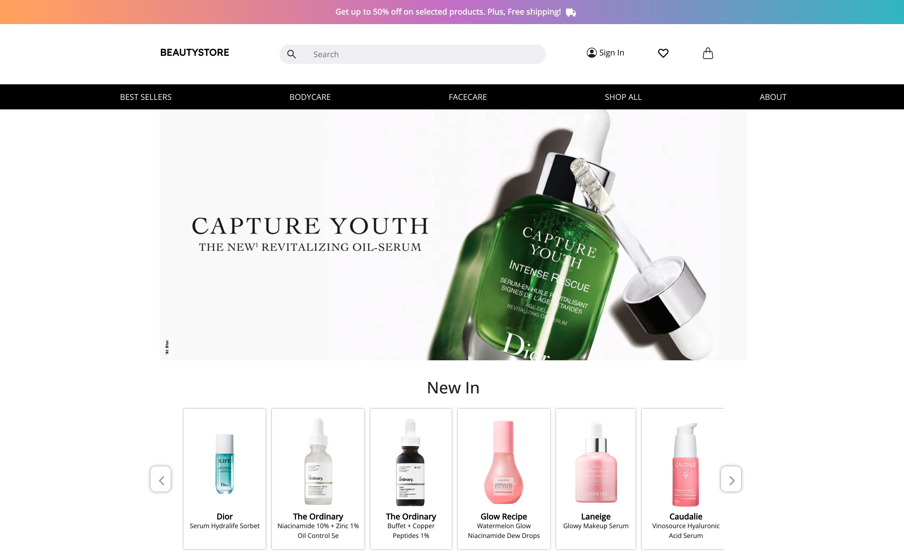
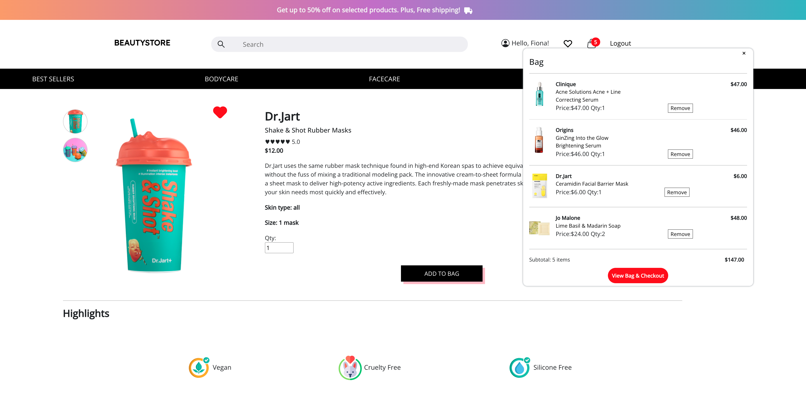

# Beauty Store

> E-commerce platform for beauty and skincare products built with React

[](https://beautystoreon.herokuapp.com/)
[](https://reactjs.org/)
[](https://getbootstrap.com/)

## 📋 Overview

Beauty Store is a modern e-commerce web application specialized in beauty and skincare products, developed as my final project during the Ironhack Web Development Bootcamp in 2021.

The platform offers an intuitive shopping experience with features like product categorization, wishlist management, shopping cart, and detailed product information including ingredients and customer reviews. This full-stack application showcases the implementation of a complete e-commerce solution using the MERN stack (MongoDB, Express, React, Node.js).

**Live Demo:** [beautystoreon.herokuapp.com](https://beautystoreon.herokuapp.com/)

## 📸 Screenshots





## ✨ Features

- **Product Catalog**: Browse through a curated collection of beauty and skincare products
- **Category Navigation**: Filter products by Body Care, Face Care, and Best Sellers
- **Product Details**: View comprehensive product information including:
  - Multiple product images with toggle view
  - Star ratings and customer reviews
  - Ingredient highlights (Vegan, Paraben-Free, Cruelty-Free, etc.)
  - Skin type recommendations
  - Size and pricing information
- **Shopping Cart**: Add products with custom quantities and manage your shopping bag
- **Wishlist (My List)**: Save favorite products for later
- **Search Functionality**: Find products quickly with the integrated search bar
- **User Authentication**: Secure signup and login system
- **Responsive Design**: Optimized for mobile and desktop devices
- **Interactive Carousels**: Featured products and promotional banners

## 🛠️ Tech Stack

- **Framework**: React 17.0.2
- **Routing**: React Router DOM 5.3.0
- **UI Framework**: Bootstrap 5.1.1 & React Bootstrap
- **HTTP Client**: Axios
- **Icons**: React Icons
- **State Management**: React Hooks (useState, useEffect, useMemo)
- **Environment Variables**: dotenv


## 🚀 Getting Started

### Prerequisites

- Node.js (version 12 or higher)
- npm or yarn
- Backend API running (see [Backend Repository](https://github.com/aquarius12345/beauty-store-app))

### Installation

1. Clone the repository:
```bash
git clone https://github.com/your-username/beauty-store-main.git
cd beauty-store-main
```

2. Install dependencies:
```bash
npm install
```

3. Create a `.env` file in the root directory and add your environment variables:
```env
REACT_APP_API=your_backend_api_url
```

4. Start the development server:
```bash
npm start
```

5. Open [http://localhost:3000](http://localhost:3000) to view it in the browser.

## 📜 Available Scripts

### `npm start`

Runs the app in development mode.\
The page will reload when you make changes.\
You may also see any lint errors in the console.

### `npm test`

Launches the test runner in interactive watch mode.

### `npm run build`

Builds the app for production to the `build` folder.\
It correctly bundles React in production mode and optimizes the build for the best performance.

The build is minified and the filenames include the hashes.

## 🔗 Related Repositories

- **Backend API**: [beauty-store-app](https://github.com/aquarius12345/beauty-store-app)

## 📄 License

This project is part of a personal portfolio and was created as a final project during the Ironhack Web Development Bootcamp in 2021.

⚠️ **Important Notice:**
- This code is available for **viewing and educational purposes only.**
- **Copying, modifying, or using this code** for commercial or personal projects **without explicit permission is prohibited.**
- For usage permissions or inquiries, please contact the repository owner.

## 👥 Contact

For questions, feedback, or permission requests, please open an issue in the GitHub repository.

---

Built with ❤️ using React
